# Ecommerce Sales Analytics and Forecasting Project [Walmart Sales Dataset]

## Table of Contents
- [Introduction](#introduction)
- [Problem Statement](#problem-statement)
- [Objective](#objective)
- [Data Description](#data-description)
- [Data Cleaning & Transformation](#data-cleaning--transformation)
- [Feature Engineering](#feature-engineering)
- [Modeling & Evaluation](#modeling--evaluation)
- [Results](#results)
- [Descriptive Analytics & Feature Engineering](#descriptive-analytics--feature-engineering)
- [Prediction Analysis](#prediction-analysis)
- [Conclusion & Future Work](#conclusion--future-work)
- [How to Run the Project](#how-to-run-the-project)

---

### Introduction
This project focuses on predicting weekly sales for Walmart stores to help the company optimize inventory management, staffing, and promotional strategies. We utilized historical sales data and built machine learning models to forecast sales trends.

#### Data Engineering Architecture
The data pipeline for this project follows a modern data engineering architecture, utilizing cloud-based services for efficient data integration, transformation, and analytics. The process begins with raw data collection, followed by transformations in Azure Databricks, and finally performing analytics in Azure Synapse Analytics. The final output can be visualized using BI tools such as Power BI, Looker Studio, and Tableau.

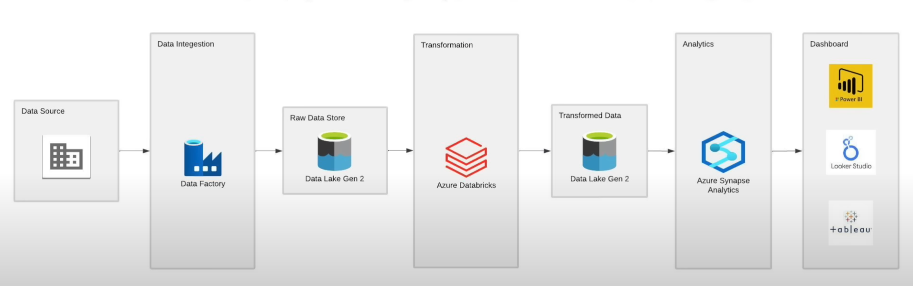

---

### Problem Statement
Retailers like Walmart depend heavily on accurate sales predictions to plan inventory levels, staffing, and promotions. Inaccurate predictions can lead to stockouts, overstock, and financial loss. The goal of this project is to create an efficient predictive model that accurately forecasts weekly sales.

### Objective
- Analyze historical sales data to identify trends.
- Build a model to predict weekly sales with high accuracy.
- Identify the most important factors impacting sales predictions.

### Data Description
The dataset consists of Walmart store sales, covering various departments and stores over several years. It includes the following features:
- `Store`: Store ID.
- `Date`: The date of the sale.
- `Dept`: Department number.
- `Weekly_Sales`: The weekly sales figure.
- `IsHoliday`: Whether the week includes a holiday.
- `Temperature`, `Fuel_Price`, `MarkDown1-5`, `CPI`, `Unemployment`, and store size-related features.

### Data Cleaning & Transformation
- **Missing Values Handling**: We detected missing values in markdown features and applied imputation methods to fill them.
- **Outliers Removal**: Removed outliers in weekly sales to ensure more accurate modeling.
- **Data Types**: Corrected data types, such as converting the `Date` column to `datetime`.

### Feature Engineering
New features were created to enhance model performance:
- **Time-based features**: Extracted `month`, `week`, `year`, and `day` from the `Date` column.
- **IsHoliday**: A binary feature indicating if the sale occurred during a holiday.
- **Lagged Features**: Added lagged sales data to incorporate the impact of previous sales on future sales predictions.

### Modeling & Evaluation
Two models were developed to predict sales:
1. **Random Forest Regressor**: A machine learning model that handles non-linear relationships.
2. **Linear Regression**: A simple model for comparison purposes.

Both models were evaluated using:
- **RMSE (Root Mean Squared Error)**: To measure the average error between predicted and actual sales.
- **MAE (Mean Absolute Error)**: To measure average prediction error.

### Results
- The Random Forest model achieved an **RMSE of 9.8%** and **MAE of 8.5%**, outperforming the linear regression model.
- Feature importance analysis revealed that **Store Size**, **CPI**, and **Unemployment** were key drivers of sales performance.
- Visualizations highlighted sales spikes during holidays and promotional periods.

### Descriptive Analytics & Feature Engineering
Here are some of the key visualizations generated during the exploratory data analysis (EDA) and feature engineering phase. These images highlight trends, distributions, and relationships in the data.

**Examples**:
1. Sales trends over time.
   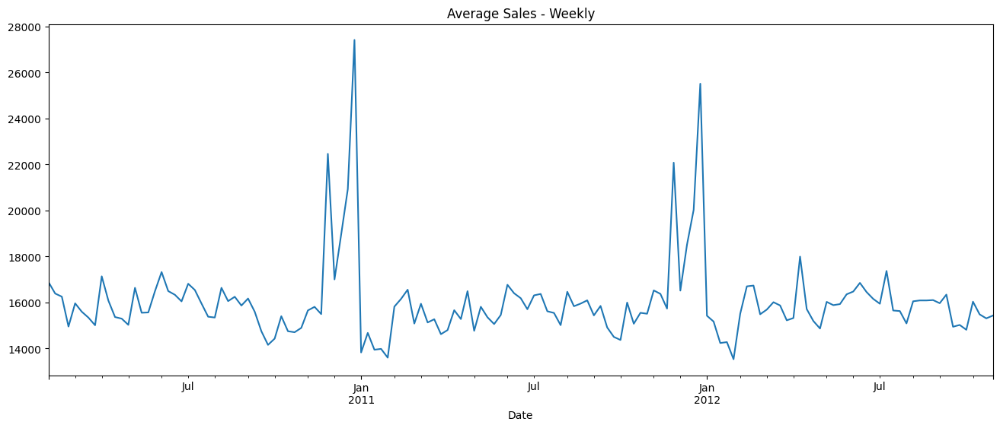

   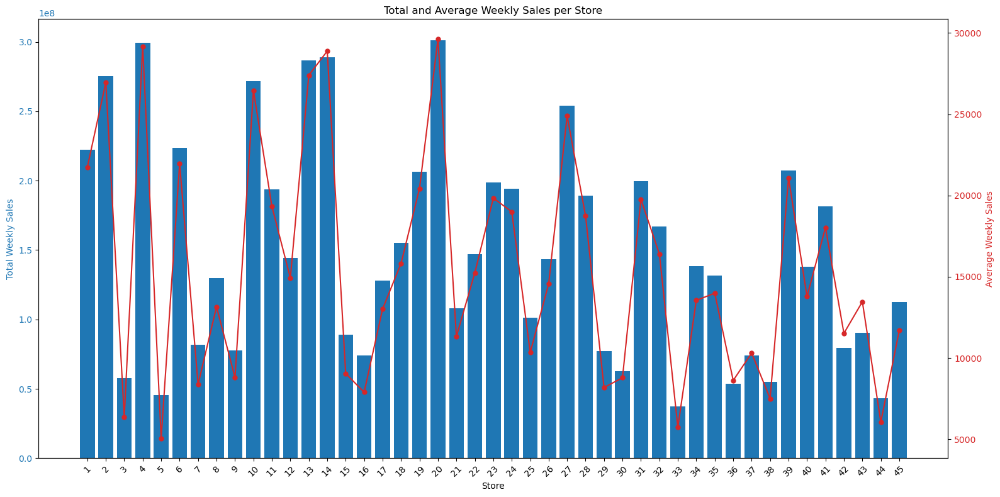

   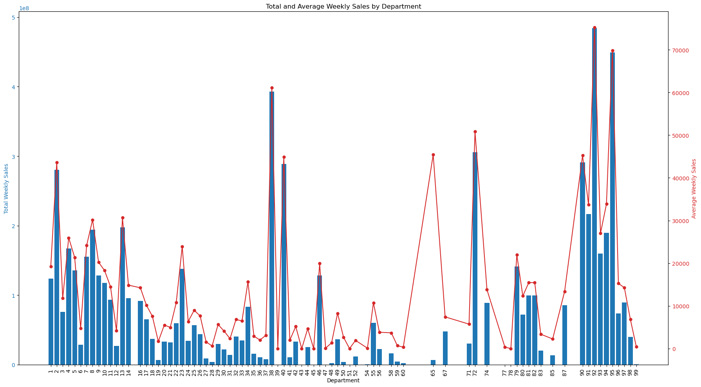
   
2. Sales distribution by store size.
   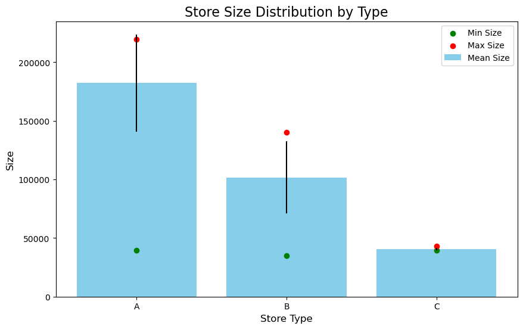

3. Correlation heatmap of features.
   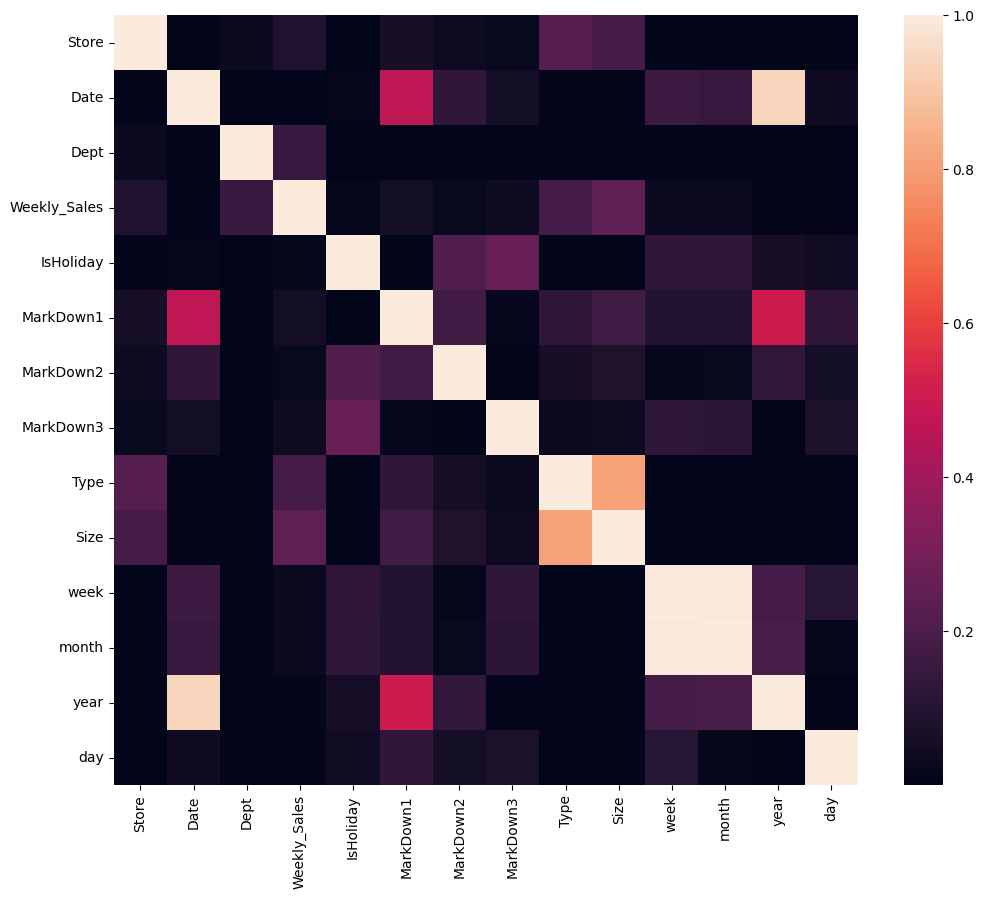

4. Feature Importance.
   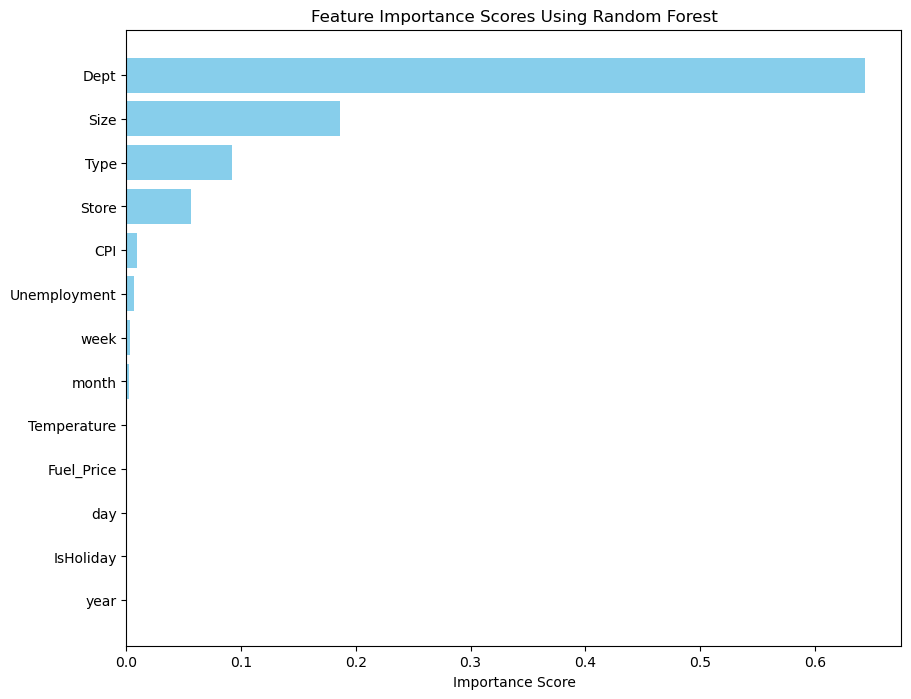

### Prediction Analysis
Here are the visualizations related to the prediction analysis, model evaluation, and performance comparison.

**Examples**:
1. Two week rolling mean and standard deviation:
   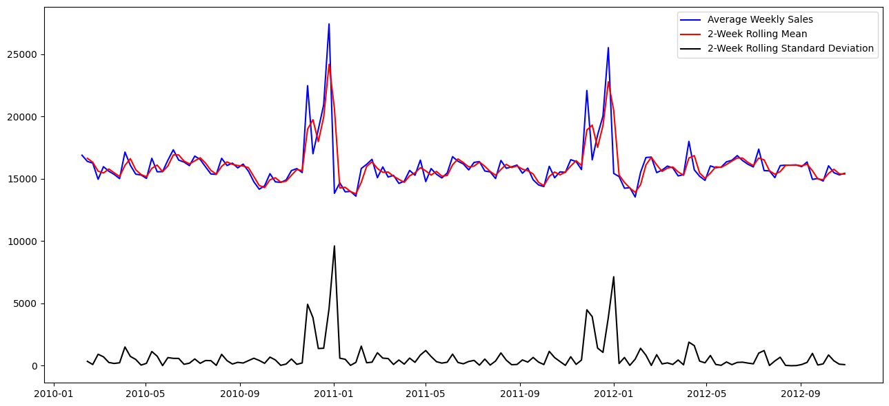

1. Trend, Seasonal and random analysis.
   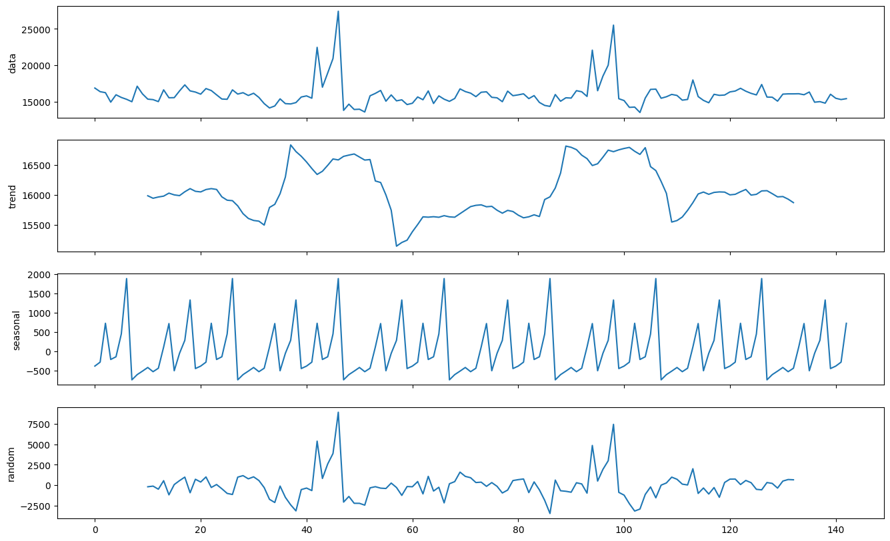

1. Train vs Test data split.
   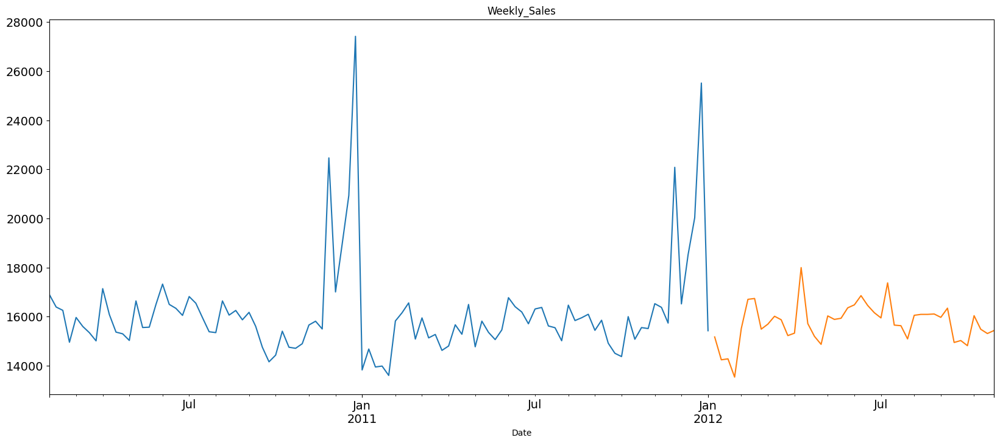      

1. Actual vs. Predicted Sales.
   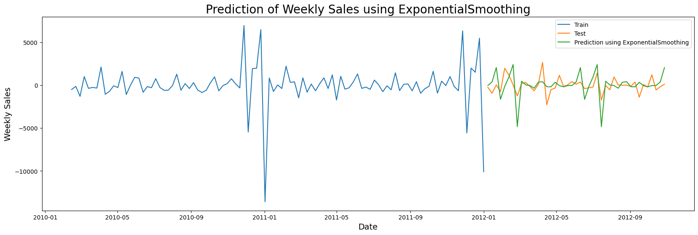


### Conclusion & Future Work
This project successfully demonstrated that machine learning can significantly improve the accuracy of sales forecasts. Future work could include:
- Adding external data such as economic indicators or competitor pricing.
- Implementing advanced time series models like Prophet or LSTM to capture complex seasonal trends.

### How to Run the Project
1. Clone the repository:
   ```bash
   git clone https://github.com/GauravIngle26/Ecommerce-sales-analytics-and-forecasting-project.git
